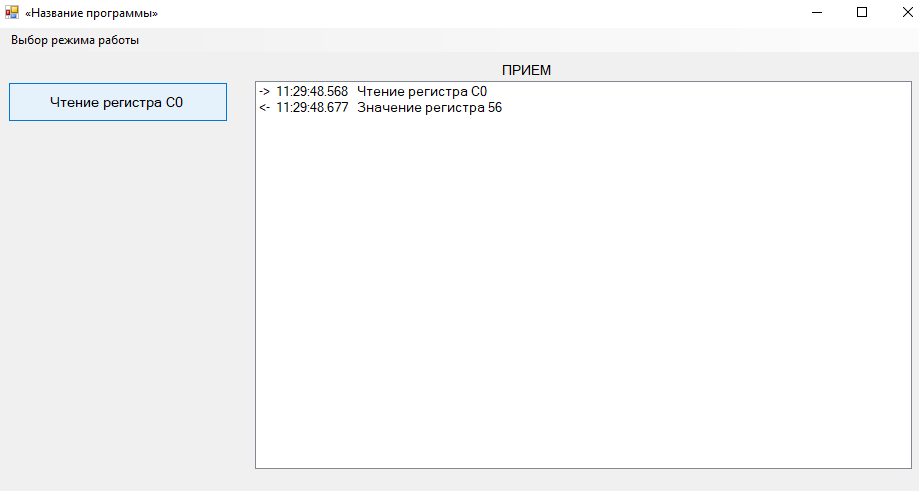

Программа позволяет отправлять и получать UDP пакеты. Она имеет два режима работы: 
"Режим работы для отладки" и "Режим работы для показа". По умолчанию выбран режим работы для показа. 
Режим работы выбирается через вкладку "Выбор режима работы", расположенную в верхней 
левой части программы.

Режим работы для показа

В данном режиме работы вся работа происходит через взаимодействие с файлом настроек ini.
В данном случае это файл inputData.ini, который располагается в папке Debug.

  
В файле inputData.ini присутствуют три основные секции:

 1. [НАЗВАНИЕ ПРОГРАММЫ] - ключ name содержит название программы, которое будет отображаться в заголовке окна.
 
 2. [ОСНОВНЫЕ НАСТРОЙКИ] - здесь определяются значения портов (локального и удаленного) и удаленного 
 адреса.
 
 3. [ОТВЕТНОЕ СООБЩЕНИЕ] -  устанавливается соответствие между выходными значениями
 и данными, которые должны быть выведены при получении этих значений.

Создание кнопок также осуществляется в этом файле. Для создания новой кнопки необходимо добавить 
новую секцию с названием кнопки в квадратных скобках. Затем для этой секции нужно указать 
значение name, которое будет отображаться на кнопке (важно, чтобы значения в квадратных 
скобках и в name совпадали). По ключу hexString записываются входные данные. 
Таким образом, создается новая кнопка, которая будет отображена на экране программы.

 

Дополнительные детали выходного сообщения записываются в файле InfoMessage.txt, который находится в 
папке Debug. Содержимое этого файла обновляется при каждом запуске программы.

  

Режим работы для показа

В данном режиме работы ввод данных происходит в самой форме. 

Для создание новой кнопки необходимо ввести название кнопки в строку Name, в строку Address ввести
адрес получателя, в строку Port ввести порт получателя и в HEX ввести данные. После этого нужно нажать
на кнопку Save для добавления новой кнопки на экран и сохранении входных данных в файл config.ini,
при последующем открытии програмы, кнопки будут выведены на экране. Затем чтобы выпонить отправку данных для 
работы необхоидмо выбрать нужную кнопку и нажать на кнопку Send. Если необходимо удалить кнопку, сначала необходимо 
нажать на галочку рядом с нужной кнопкой и нажать на кнопку Delete. В результате кнопка будет удалена с экрана,
также данные по этой кнопку будут удалены из config.ini файле. Также все входные и выходные сообщения могут быть
сохранены в файл OutputFile.txt, который расположен в папке Debug. 

В файле config.ini присутствуют две основные секции:

 1. [НАЗВАНИЕ ПРОГРАММЫ] - ключ name содержит название программы, которое будет отображаться в заголовке окна.
 
 2. [Name] - в этой секции записывается порядковый номер созданной кнопки, а также ее название. 

Также в этом файле записываются данные, которые были введены на форме. 
Данные каждой кнопки записываются в новой секции, название которой соответствует названию кнопки.

В каждой секции содержатся следующие ключи и их значения:

- name: Название кнопки.
- remoteIP: IP-адрес получателя.
- remotePort: Порт получателя.
- localIP: IP-адрес отправителя.
- localPort: Порт отправителя.
- hexString: Входные данные.
- protocolType: Тип протокола передачи.
- repeat: Количество неудачных попыток отправления сообщения. 
Счетчик увеличивается, если отправителем не получен ответ.
- sendResponse: Количество успешных попыток отправления сообщения. 
Счетчик увеличивается, если отправителем получен ответ.
- dataTime: Время последнего нажатия на кнопку.

Каждая секция описывает одну кнопку, и ключи содержат информацию о настройках 
и данных, связанных с этой кнопкой.

